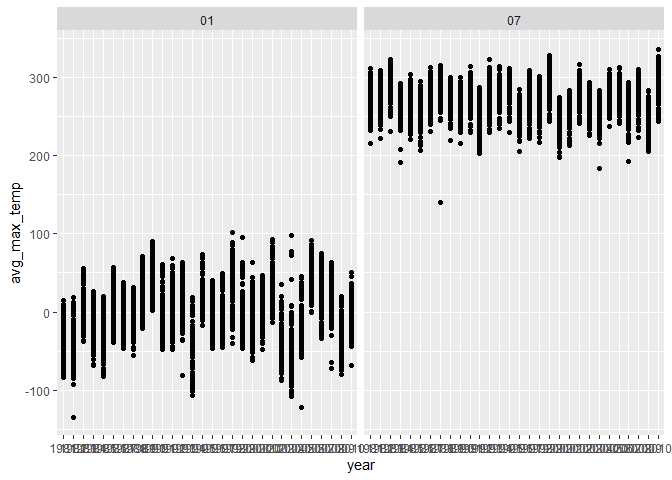

p8105_hw3_jl7035
================
Jeffrey Lin
2024-10-12

# Load Necessary Libraries

``` r
library(tidyverse)
```

    ## ── Attaching core tidyverse packages ──────────────────────── tidyverse 2.0.0 ──
    ## ✔ dplyr     1.1.4     ✔ readr     2.1.5
    ## ✔ forcats   1.0.0     ✔ stringr   1.5.1
    ## ✔ ggplot2   3.5.1     ✔ tibble    3.2.1
    ## ✔ lubridate 1.9.3     ✔ tidyr     1.3.1
    ## ✔ purrr     1.0.2     
    ## ── Conflicts ────────────────────────────────────────── tidyverse_conflicts() ──
    ## ✖ dplyr::filter() masks stats::filter()
    ## ✖ dplyr::lag()    masks stats::lag()
    ## ℹ Use the conflicted package (<http://conflicted.r-lib.org/>) to force all conflicts to become errors

``` r
library(ggplot2)
library(ggridges)
library(patchwork)
```

# Problem 1

Load Data

``` r
library(p8105.datasets)
data("ny_noaa")
```

Inspect Data

``` r
head(ny_noaa)
```

    ## # A tibble: 6 × 7
    ##   id          date        prcp  snow  snwd tmax  tmin 
    ##   <chr>       <date>     <int> <int> <int> <chr> <chr>
    ## 1 US1NYAB0001 2007-11-01    NA    NA    NA <NA>  <NA> 
    ## 2 US1NYAB0001 2007-11-02    NA    NA    NA <NA>  <NA> 
    ## 3 US1NYAB0001 2007-11-03    NA    NA    NA <NA>  <NA> 
    ## 4 US1NYAB0001 2007-11-04    NA    NA    NA <NA>  <NA> 
    ## 5 US1NYAB0001 2007-11-05    NA    NA    NA <NA>  <NA> 
    ## 6 US1NYAB0001 2007-11-06    NA    NA    NA <NA>  <NA>

There are 2595176 data points and 7 variables of interest in this
dataset. The key variables in this dataset are the id of the weather
station, the date of which data was collected, amount of precipitation,
amount of snow, depth of the snow, and the minimum and maximum
temparature on that given date. Examining the number of missing values
in this dataset, I would argue that they are a valid concern. With a
large amount of missing values, any plots made may not accurately
represent real life conditions. This conclusion is driven by the number
of missing values in this dataset, which is 3387623. Naturally, merely
summing the amount of NA values it not necessarily the most accurate
measure, as it doesn’t capture how NA is spread across the columns.

## Clean the Data

``` r
ny_noaa <- ny_noaa %>% 
  mutate(
    tmax = as.numeric(tmax),
    tmin = as.numeric(tmin),
  ) %>%
  separate(date, into = c("year", "month", "day"), sep = "-")

head(ny_noaa)
```

    ## # A tibble: 6 × 9
    ##   id          year  month day    prcp  snow  snwd  tmax  tmin
    ##   <chr>       <chr> <chr> <chr> <int> <int> <int> <dbl> <dbl>
    ## 1 US1NYAB0001 2007  11    01       NA    NA    NA    NA    NA
    ## 2 US1NYAB0001 2007  11    02       NA    NA    NA    NA    NA
    ## 3 US1NYAB0001 2007  11    03       NA    NA    NA    NA    NA
    ## 4 US1NYAB0001 2007  11    04       NA    NA    NA    NA    NA
    ## 5 US1NYAB0001 2007  11    05       NA    NA    NA    NA    NA
    ## 6 US1NYAB0001 2007  11    06       NA    NA    NA    NA    NA

Here I noticed that tmax and tmin were originally char types, which is
why I changed them to numeric. The separation of the date into 3 columns
was per the instructions of the spec.

## Find most commonly observed values for snowfall

``` r
ny_noaa %>% 
  count(snow) %>% 
  arrange(desc(n))
```

    ## # A tibble: 282 × 2
    ##     snow       n
    ##    <int>   <int>
    ##  1     0 2008508
    ##  2    NA  381221
    ##  3    25   31022
    ##  4    13   23095
    ##  5    51   18274
    ##  6    76   10173
    ##  7     8    9962
    ##  8     5    9748
    ##  9    38    9197
    ## 10     3    8790
    ## # ℹ 272 more rows

The most commonly occurring value for snowfall is 0. This likely because
the wide majority of days per year do not see snowfall. Afterwards, the
second most frequently appearing value is NA, indicating missing data.
Afterwards, we also see values like 25, 13, 51, and 76, however I am not
sure why these values are so commonly occurring.

## Make a two-panel plot showing the average max temperature in January and in July in each station across years. Is there any observable / interpretable structure? Any outliers?

``` r
ny_noaa %>% 
  group_by(id, month, year) %>% 
  filter(month == '01'|month == '07') %>% 
  summarise(avg_max_temp = mean(tmax, na.rm = TRUE)) %>% 
  ggplot(aes(x = year, y = avg_max_temp, group = id)) +
  geom_point() +
  facet_grid(~month)
```

    ## `summarise()` has grouped output by 'id', 'month'. You can override using the
    ## `.groups` argument.

    ## Warning: Removed 5970 rows containing missing values or values outside the scale range
    ## (`geom_point()`).

<!-- -->

Examining this plot, we see the general trend that across all the
reporting weather stations, the average max temperature seen is higher
in July than January. This trend remains consistent throughout the
entire span of years. There are a couple of outlier cases. The most
notable appears to occur in July of 1987, where there was an
uncharacteristically low average max temperature reported by a weather
station.

## Make a two-panel plot showing (i) tmax vs tmin for the full dataset (note that a scatterplot may not be the best option); and(ii) make a plot showing the distribution of snowfall values greater than 0 and less than 100 separately by year

``` r
tmax_vs_tmin <- ny_noaa %>% 
  ggplot(aes(x = tmax, y = tmin)) +
  geom_hex()

snowfall_less_100 <- ny_noaa %>%
  group_by(year) %>% 
  filter(snow > 0 & snow < 100) %>% 
  ggplot(aes(x = snow, y = year)) +
  geom_density_ridges() +
  ylab("snow fall")
  
tmax_vs_tmin + snowfall_less_100
```

    ## Warning: Removed 1136276 rows containing non-finite outside the scale range
    ## (`stat_binhex()`).

    ## Picking joint bandwidth of 3.76

<!-- -->

Regarding the hexplot, we notice that highest count of data fall around
the values of 0 for tmax and tmin. Furthermore, that seems to show that
the data is clustering at the center of the plot. Regarding the ridge
plot, we can notice some multi-modal behavior, such that for each given
year, there are several cases of commonly occurring snow values. These
values remained relatively consistent from 1981 to 2010, and can be
identified as roughly 15, 25, and 45

# Problem 2

## Load in and clean each dataset

``` r
demographic_df <- 
  read_csv("Data/nhanes_covar.csv",
    na = c("", "NA", "."),
    skip = 4
  ) %>% 
  janitor::clean_names() %>% 
  mutate(
    sex = factor(
      sex, 
      levels = c("1", "2"), 
      labels = c("male", "female")),
    education = factor(
      education,
      levels = c("1", "2", "3"),
      labels = c("Less than high school", "High School Equivalent", 
                 "More than high school")
    )
  ) %>% 
  filter(
    age >= 21
  ) %>% 
  drop_na()
```

    ## Rows: 250 Columns: 5
    ## ── Column specification ────────────────────────────────────────────────────────
    ## Delimiter: ","
    ## dbl (5): SEQN, sex, age, BMI, education
    ## 
    ## ℹ Use `spec()` to retrieve the full column specification for this data.
    ## ℹ Specify the column types or set `show_col_types = FALSE` to quiet this message.

``` r
head(demographic_df)
```

    ## # A tibble: 6 × 5
    ##    seqn sex      age   bmi education             
    ##   <dbl> <fct>  <dbl> <dbl> <fct>                 
    ## 1 62161 male      22  23.3 High School Equivalent
    ## 2 62164 female    44  23.2 More than high school 
    ## 3 62169 male      21  20.1 High School Equivalent
    ## 4 62174 male      80  33.9 More than high school 
    ## 5 62177 male      51  20.1 High School Equivalent
    ## 6 62178 male      80  28.5 High School Equivalent

``` r
accelerometer_df <- 
  read_csv("Data/nhanes_accel.csv",
    na = c("NA", "", ".")
  ) %>%  
  janitor::clean_names() %>%
  pivot_longer(
    min1:min1440,
    names_to = "Minute",
    values_to = "MIMS"
  ) %>% 
  mutate(
    Minute = as.numeric(str_remove(Minute, "min"))
  )
```

    ## Rows: 250 Columns: 1441
    ## ── Column specification ────────────────────────────────────────────────────────
    ## Delimiter: ","
    ## dbl (1441): SEQN, min1, min2, min3, min4, min5, min6, min7, min8, min9, min1...
    ## 
    ## ℹ Use `spec()` to retrieve the full column specification for this data.
    ## ℹ Specify the column types or set `show_col_types = FALSE` to quiet this message.

## Join dfs together

``` r
accel_participant_df <-
  left_join(
    demographic_df, 
    accelerometer_df, 
    by = "seqn")

anti_join(demographic_df, accel_participant_df)
```

    ## Joining with `by = join_by(seqn, sex, age, bmi, education)`

    ## # A tibble: 0 × 5
    ## # ℹ 5 variables: seqn <dbl>, sex <fct>, age <dbl>, bmi <dbl>, education <fct>

\##Produce reader-friendly table for number of men and women in each
education category

``` r
demographic_df %>% 
  group_by(sex, education) %>% 
  count() %>% 
  pivot_wider(
    names_from = education,
    values_from = n
  ) %>% 
  knitr::kable()
```

| sex    | Less than high school | High School Equivalent | More than high school |
|:-------|----------------------:|-----------------------:|----------------------:|
| male   |                    27 |                     35 |                    56 |
| female |                    28 |                     23 |                    59 |

Looking at the count of the number of men and women in each education
category, we can see that there only appears to be a major difference in
the number of

men and women high school equivalent category, such that there were 12
more male participants than female participants with a high school
equivalent education. Interestingly, more female participants had more
than high school education compared to men, but only by a difference of
+3.

## create visualization of age distribution for each education category

``` r
ggplot(demographic_df, aes(x = education, y = age, fill = sex)) +
  geom_boxplot(outliers = TRUE)
```

<!-- -->

Examining the distribution of age by educational level for male and
female participants. We can once again notice some differences. Firstly,
we can note that while the median age of men and women in the less than
high school and more than high school categories are relatively similar,
we see a more substantial difference in the high school equivalent
category. Here, female participants have a median age hovering around
62-63, which is higher than the male equivalent, at roughly 54. Looking
at the spread of values in each of the 3 categories, we can notice,
perhaps a tiny bit of skew. In the less than high school and high school
equivalent categories, for both men and women, the distance between
median and q3 is slightly smaller and suggestive of a potential slight
left skew. For the more than high school equivalent, the median is
closer to q1, and potentially suggests a slight right skew. Lastly, we
can see that the whole distribution of ages for the female high school
equivalent category is shifted upwards compared to the male counterpart,
as the q1 and q3 are higher in the female category vs the male.

## compare total activity for men and women and by education

``` r
demographic_df <- accel_participant_df %>% 
  group_by(seqn) %>% 
  select(MIMS, seqn) %>% 
  summarise(total_activity = sum(MIMS)) %>% 
  left_join(demographic_df, by = "seqn") %>% 
  relocate(total_activity, .after = education)

ggplot(demographic_df, aes(x = age, y = total_activity, color = sex)) +
  xlab("Age of Participant") +
  ylab("Total MIMS") +
  geom_point( alpha = 0.5) +
  geom_smooth(aes(color = sex), se = FALSE) +
  facet_grid(.~education)
```

    ## `geom_smooth()` using method = 'loess' and formula = 'y ~ x'

<!-- -->

Looking at these 3 plots, firstly it must be noted that there seems to
be great variation in the total activity levels by age for both sexes,
so the trend lines do not fit with the data perfectly. Now, comparing
the 3 categories, it is interesting to note that participants in the
less than high school education category start with the highest Total
MIMS at ages close to 20, but see a sharp decline by age 80, such that
they seem to be lower than the other two educational categories. Now
looking at each of the three educational categories, for less than high
school, it seems that female participants have more total activity when
they are younger, but men surpass them around age and even see a
resurgent increase in activity around 60. Ultimately, both sexes finish
with similar activity levels in old age. For high school equivalent,
female participants consistently show more activity than their male
counterparts, until they reach age 80. Interestingly, women see upticks
in activity around ages 40 (global maximum) and 70 (local maximum).
Lastly, in the more than high school education category, female
participants show more activity than men consistently until age 80.
Women seem to peak in total MIMS when nearing age 60, before waning
afterwards. Men reach their peak activity earlier, around 45, before
decreasing afterwards, albeit at a less steep rate than their female
counterparts.

## Create df representing hourly activity of participants

``` r
daily_activity <- accel_participant_df %>% 
  mutate(hour = ceiling(Minute / 60)) %>% 
  group_by(seqn, hour) %>%
  summarise(hourly_activity = sum(MIMS)) %>% 
  left_join(demographic_df) %>% 
  relocate(hourly_activity, .before = total_activity)
```

    ## `summarise()` has grouped output by 'seqn'. You can override using the
    ## `.groups` argument.
    ## Joining with `by = join_by(seqn)`

## 24-hour activity time courses for each education level, shown by sex

``` r
ggplot(daily_activity, aes(x = hour, y = hourly_activity, color = sex)) +
  geom_point(alpha = 0.2) +
  geom_smooth(aes(color = sex), se =FALSE) +
  scale_x_continuous(
    breaks = seq(0, 24, by = 4),
    limits = c(0,24)) +
  viridis::scale_color_viridis(
    discrete = TRUE
  ) +
  xlab("Hour of the Day") +
  ylab("Activity by Hour") +  
  facet_grid(.~education) 
```

    ## `geom_smooth()` using method = 'gam' and formula = 'y ~ s(x, bs = "cs")'

<!-- -->

Looking at the graphs, we notice a similar pattern of hourly activity
across the 24 hours for all 3 educational categories and for both sexes.
Activity tends to be the lowest in the early hours of the day, hitting a
global minimum around hour 4. Afterwards, activity steadily increases
until midday and stay relatively consistent until decreasing once again
around hour 20 and until hour 24 (likely when participants are getting
ready to sleep). Interestingly, we see a slight steeper decline in
activity beginning around hour 12 for participants with less than high
school education compared to the other 2 categories. Generally, the
trends in activity correspond to the awake hours of the participants. We
see the activities reach the lowest in that hour 0-4 range, suggesting a
time frame where the participants are consistently asleep.

# Problem 3

## Clean January 2020 Dataset

``` r
Jan_2020 <- 
  read_csv(
    file = "Data/citibike/Jan 2020 Citi.csv",
    na = c("NA", "", "."),
    col_select = c(ride_id:member_casual)) %>%
  janitor::clean_names() %>% 
  mutate(
    month_year = "January 2020"
  )
```

    ## Rows: 12420 Columns: 7
    ## ── Column specification ────────────────────────────────────────────────────────
    ## Delimiter: ","
    ## chr (6): ride_id, rideable_type, weekdays, start_station_name, end_station_n...
    ## dbl (1): duration
    ## 
    ## ℹ Use `spec()` to retrieve the full column specification for this data.
    ## ℹ Specify the column types or set `show_col_types = FALSE` to quiet this message.

``` r
head(Jan_2020)
```

    ## # A tibble: 6 × 8
    ##   ride_id    rideable_type weekdays duration start_station_name end_station_name
    ##   <chr>      <chr>         <chr>       <dbl> <chr>              <chr>           
    ## 1 4BE06CB33… classic_bike  Tuesday     15.3  Columbus Ave & W … E 53 St & Madis…
    ## 2 26886E034… classic_bike  Wednesd…     5.31 2 Ave & E 96 St    1 Ave & E 110 St
    ## 3 24DC56060… classic_bike  Friday       9.69 Columbia St & Riv… Grand St & Eliz…
    ## 4 EEDC10535… classic_bike  Sunday       7.00 W 84 St & Columbu… Columbus Ave & …
    ## 5 2CD4BD4CE… classic_bike  Friday       2.85 Forsyth St & Broo… Suffolk St & St…
    ## 6 E18682F9A… classic_bike  Sunday      25.5  Allen St & Hester… Atlantic Ave & …
    ## # ℹ 2 more variables: member_casual <chr>, month_year <chr>

## Clean January 2024 Dataset

``` r
Jan_2024 <- 
  read_csv(
    file = "Data/citibike/Jan 2024 Citi.csv",
    na = c("NA", "", "."),
    col_select = c(ride_id:member_casual)) %>% 
  janitor::clean_names() %>% 
  mutate(
    month_year = "January 2024"
  )
```

    ## Rows: 18861 Columns: 7
    ## ── Column specification ────────────────────────────────────────────────────────
    ## Delimiter: ","
    ## chr (6): ride_id, rideable_type, weekdays, start_station_name, end_station_n...
    ## dbl (1): duration
    ## 
    ## ℹ Use `spec()` to retrieve the full column specification for this data.
    ## ℹ Specify the column types or set `show_col_types = FALSE` to quiet this message.

``` r
head(Jan_2024)
```

    ## # A tibble: 6 × 8
    ##   ride_id    rideable_type weekdays duration start_station_name end_station_name
    ##   <chr>      <chr>         <chr>       <dbl> <chr>              <chr>           
    ## 1 644A0105A… electric_bike Wednesd…    16.5  Lafayette St & Je… W 50 St & 9 Ave 
    ## 2 A5A8C0AD1… electric_bike Wednesd…     6.29 Clinton St & Till… Duffield St & W…
    ## 3 B392CE349… electric_bike Tuesday      6.12 West End Ave & W … W 116 St & Broa…
    ## 4 33756EDC7… electric_bike Wednesd…    10.9  Grand St & Elizab… Front St & Jay …
    ## 5 29D9AF64D… electric_bike Thursday     8.42 12 Ave & W 40 St   Washington St &…
    ## 6 C7E61191A… electric_bike Sunday      18.5  7 Ave & Central P… 44 Dr & Jackson…
    ## # ℹ 2 more variables: member_casual <chr>, month_year <chr>

## Clean July 2020 Dataset

``` r
July_2020 <- 
  read_csv(
    file = "Data/citibike/July 2020 Citi.csv",
    na = c("NA", "", "."),
    col_select = c(ride_id:member_casual)) %>% 
  janitor::clean_names() %>%
  mutate(
    month_year = "July 2020"
  )
```

    ## Rows: 21048 Columns: 7
    ## ── Column specification ────────────────────────────────────────────────────────
    ## Delimiter: ","
    ## chr (6): ride_id, rideable_type, weekdays, start_station_name, end_station_n...
    ## dbl (1): duration
    ## 
    ## ℹ Use `spec()` to retrieve the full column specification for this data.
    ## ℹ Specify the column types or set `show_col_types = FALSE` to quiet this message.

``` r
head(July_2020)
```

    ## # A tibble: 6 × 8
    ##   ride_id    rideable_type weekdays duration start_station_name end_station_name
    ##   <chr>      <chr>         <chr>       <dbl> <chr>              <chr>           
    ## 1 A7503F194… classic_bike  Sunday       9.86 Franklin Ave & Em… Grand Army Plaz…
    ## 2 B47EBE0EA… classic_bike  Monday       8.29 E 33 St & 1 Ave    E 33 St & 5 Ave 
    ## 3 8146F6C68… classic_bike  Wednesd…     5.39 George St & Wilso… Willoughby Ave …
    ## 4 D49560E33… classic_bike  Saturday    19.2  St. Nicholas Ave … Willis Ave & E …
    ## 5 87687AAE4… classic_bike  Tuesday     26.4  Front St & Jay St  Grand St & Eliz…
    ## 6 E30DFCD98… classic_bike  Sunday      51.9  Clinton St & Jora… Myrtle Ave & Li…
    ## # ℹ 2 more variables: member_casual <chr>, month_year <chr>

## Clean July 2024 Dataset

``` r
July_2024 <- 
  read_csv(
    file = "Data/citibike/July 2024 Citi.csv",
    na = c("NA", "", "."),
    col_select = c(ride_id:member_casual)) %>% 
  janitor::clean_names() %>%
  mutate(
    month_year = "July 2024"
  )
```

    ## Rows: 47156 Columns: 7
    ## ── Column specification ────────────────────────────────────────────────────────
    ## Delimiter: ","
    ## chr (6): ride_id, rideable_type, weekdays, start_station_name, end_station_n...
    ## dbl (1): duration
    ## 
    ## ℹ Use `spec()` to retrieve the full column specification for this data.
    ## ℹ Specify the column types or set `show_col_types = FALSE` to quiet this message.

``` r
head(July_2024)
```

    ## # A tibble: 6 × 8
    ##   ride_id    rideable_type weekdays duration start_station_name end_station_name
    ##   <chr>      <chr>         <chr>       <dbl> <chr>              <chr>           
    ## 1 86AE148E3… classic_bike  Sunday      19.7  Picnic Point       Yankee Ferry Te…
    ## 2 FCF07A30F… electric_bike Thursday     7.68 W 54 St & 9 Ave    W 42 St & 8 Ave 
    ## 3 D8397E843… classic_bike  Thursday    24.5  12 Ave & W 40 St   W 84 St & Amste…
    ## 4 E575690C1… electric_bike Tuesday      3.53 Grand St & Haveme… S 4 St & Rodney…
    ## 5 184AABED4… electric_bike Wednesd…    24.1  Broadway & Kent A… Henry St & Degr…
    ## 6 ACA61A92B… classic_bike  Saturday     7.83 E 1 St & 1 Ave     Mercer St & Spr…
    ## # ℹ 2 more variables: member_casual <chr>, month_year <chr>

\##Combine the datasets

``` r
Jan_July_20_24 <- rbind(Jan_2020, July_2020, Jan_2024, July_2024) %>% 
  mutate(
    weekdays = factor(
      weekdays,
      levels = c("Monday", "Tuesday", "Wednesday", "Thursday", "Friday", 
                 "Saturday", "Sunday")
    )
  )

head(Jan_July_20_24)
```

    ## # A tibble: 6 × 8
    ##   ride_id    rideable_type weekdays duration start_station_name end_station_name
    ##   <chr>      <chr>         <fct>       <dbl> <chr>              <chr>           
    ## 1 4BE06CB33… classic_bike  Tuesday     15.3  Columbus Ave & W … E 53 St & Madis…
    ## 2 26886E034… classic_bike  Wednesd…     5.31 2 Ave & E 96 St    1 Ave & E 110 St
    ## 3 24DC56060… classic_bike  Friday       9.69 Columbia St & Riv… Grand St & Eliz…
    ## 4 EEDC10535… classic_bike  Sunday       7.00 W 84 St & Columbu… Columbus Ave & …
    ## 5 2CD4BD4CE… classic_bike  Friday       2.85 Forsyth St & Broo… Suffolk St & St…
    ## 6 E18682F9A… classic_bike  Sunday      25.5  Allen St & Hester… Atlantic Ave & …
    ## # ℹ 2 more variables: member_casual <chr>, month_year <chr>

## Create reader-friendly table showing total number of rides in each combination of year and month separating casual riders and Citi Bike members

``` r
Jan_July_20_24 %>% 
  select(month_year, member_casual) %>% 
  group_by(month_year, member_casual) %>% 
  count() %>% 
  pivot_wider(
    names_from = month_year,
    values_from = n
  ) %>%
  relocate("July 2020", .after = "January 2020") %>% 
  knitr::kable()
```

| member_casual | January 2020 | July 2020 | January 2024 | July 2024 |
|:--------------|-------------:|----------:|-------------:|----------:|
| casual        |          984 |      5637 |         2108 |     10894 |
| member        |        11436 |     15411 |        16753 |     36262 |

Looking at the table, we can see that usage of Citi bike seems to wane
in January for both casual users and membership holders, irrespective of
the year of the data. This makes sense as one would assume bike usage
decreases in the winter. It is also interesting to note that the number
of uses of Citi bike in the months of January and July increased from
2020 to 2024 for both the casual user and membership holder groups.

## 5 most popular starting stations for July 2024

``` r
July_2024 %>% 
  select(start_station_name) %>% 
  group_by(start_station_name) %>% 
  count() %>% 
  arrange(desc(n)) %>% 
  head(5) %>% 
  rename(
    "number_uses" = n
  ) %>% 
  knitr::kable()
```

| start_station_name       | number_uses |
|:-------------------------|------------:|
| Pier 61 at Chelsea Piers |         163 |
| University Pl & E 14 St  |         155 |
| W 21 St & 6 Ave          |         152 |
| West St & Chambers St    |         150 |
| W 31 St & 7 Ave          |         146 |

## plot to investigate the effects of day of the week, month, and year on median ride duration

``` r
Jan_July_20_24 <- Jan_July_20_24 %>% 
  separate(month_year, c("month", "year"), sep = " ")

ggplot(Jan_July_20_24, aes(x = weekdays, y = duration, fill = month)) +
  geom_violin(alpha = 0.5) +
  stat_summary(
    aes(group = month),
    fun = "median", 
    color = "blue", 
    position = position_dodge(width = 0.9),
    show.legend = FALSE) +
  xlab("Day of the Week") +
  ylab("Duration of Bike Ride") +
  facet_grid(.~year)
```

    ## Warning: Removed 14 rows containing missing values or values outside the scale range
    ## (`geom_segment()`).
    ## Removed 14 rows containing missing values or values outside the scale range
    ## (`geom_segment()`).

<!-- -->

Looking at the series of violin plots. There are couple of interesting
things to point out. Firstly, regardless of day of week, or month, or
year, the violin plots for duration of bike ride demonstrate significant
right skew. We can see that most values clusters between 0 and 25, yet a
large amount of upper-bound outliers skew the distribution. This is why
we see these long, thin tails moving upwards from each violin plot.
Secondly, it is interesting to note that while the median duration of
ride is greater in July for both 2020 and 2024, from a visual scan, it
seems that the gap has actually decreased from 2020 to 2024.
Furthermore, we see that the portions of the violin plot with more
substantial concentration of data points seem longer in 2020 than 2024.
I wonder if this relates to the increase in usage of Citi bikes from
2020 to 2024. Perhaps there is a sampling effect at play, where in 2020,
more avid bikers (either casual or membership-holding) were using Citi
bike and thus had longer bike rides. By 2024, with a greater influx of
riders, perhaps these new riders dragged the median values downwards.
Lastly, I would like to note that there does not seem to be a large
amount of variation in the duration of bike ride by day (based solely on
the median). The medians are relatively similar for each day of the
week, even when segmenting into the two differing months and the two
different years.

## Figure that shows the impact of month, membership status, and bike type on the distribution of ride duration

``` r
Jan_July_20_24 %>% 
  filter(year == "2024") %>% 
ggplot(aes(x = month, y = duration, fill = member_casual )) +
  geom_violin(alpha = 0.5) +
  stat_summary(
    fun = "median", 
    color = "blue",
    position = position_dodge(0.9)) +
  xlab("Month of the Year") +
  ylab("Duration of Bike Ride") +
  facet_grid(.~rideable_type)
```

    ## Warning: Removed 4 rows containing missing values or values outside the scale range
    ## (`geom_segment()`).
    ## Removed 4 rows containing missing values or values outside the scale range
    ## (`geom_segment()`).

<!-- -->

Looking at these two plots, we can first notice that based on the median
duration of Bike Ride, casual users of Citi Biker seem to go on slightly
longer bike rides when using the classic bike compared to
membership-holders. It must be stated that the difference is quite
small. Regarding the electronic bike, based on the median duration of
bike ride, there does not seem to be much difference between the casual
user and the membership-holder. The results stated thus far are
irrespective of the month of the year. Now if we examine the exact
shapes of the violin plots, we can once again notice some differences.
Interestingly, the membership holder had bike-ride durations clustered
closer to 0 for both the months of January and July. The shape of the
violin plot for casual users of the classic bike in January and July are
a bit different. They are more evenly spread out, such that there is a
more even concentration of values from 0 to ~30. This trend did not
follow through with the violin plots for causal users’ and
membership-holders’ usage of the electric bike during January and July.
In these cases, the shapes of the violin plots were very similar.
Lastly, it appears that all these violin plots show a positive skew.
